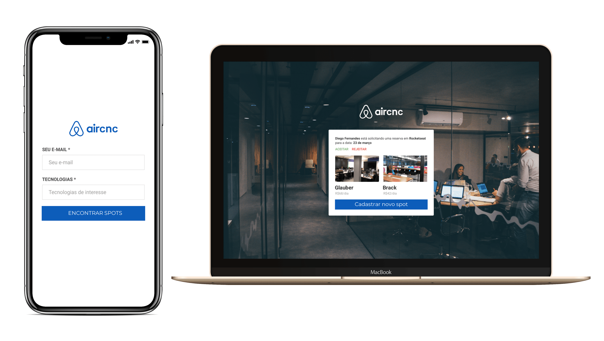

<h1 align="center">
    
</h1>

<h4 align="center">
   Get your 7-Day weather forescast for your city. 
</h4>

 

  

## 💻 Project

This project was development by inspirantion in Airbnb, where an dev can find/register an spot where another devs can schedule this. Besides, this project was created on Oministack 9.0.

## :rocket: Techs

- [Node.jg]
- [ReactJS]
- [ReactNative]

---

☕ Glauber Brack
